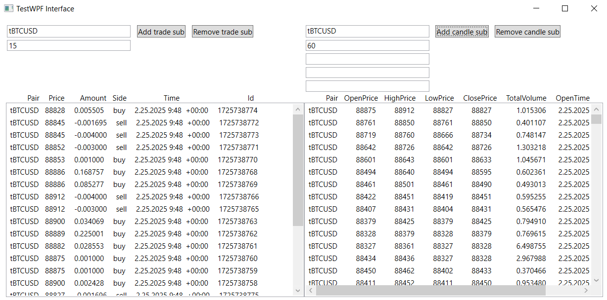
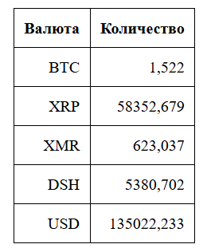

# Тестовое задание

Реализован коннектор под указанный интерфейс. Использовано API Bitfinex v2.

Для REST API клиента написаны [интеграционные тесты](./IntegrationTests).

Для Websocket API клиента написано приложение для вывода [на WPF](./TestWPF).

Требуемый расчет реализован с использованием [ASP.NET](./CurrencyConverter).

